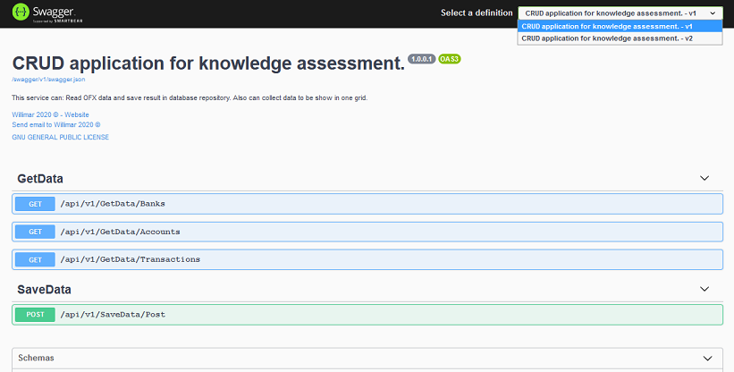
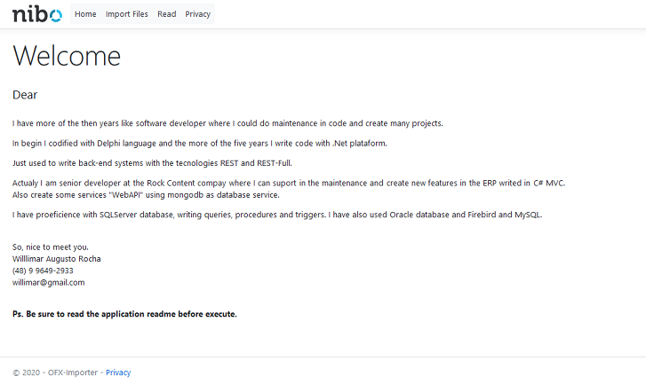
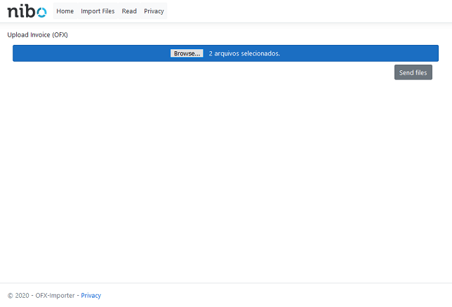
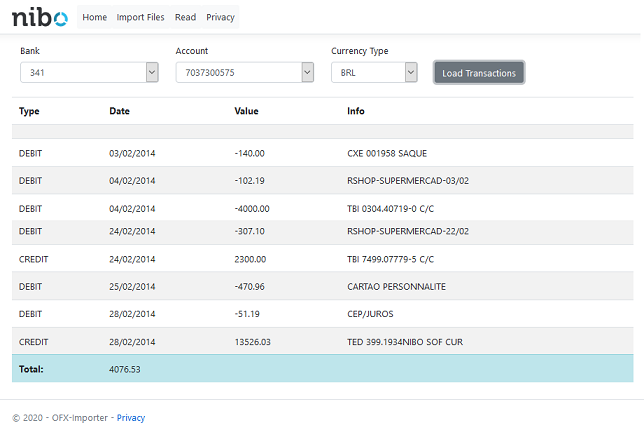

# OFX Importer v1.0

Este projeto se trata de um processo de avaliação não me responsabilizo pelo uso indevido e não irei mantê-lo após o resultado.

O projeto é constituido de três camadas e mais abaixo irei descrever cada uma delas. Num situação real não seria criada uma única solução contendo todos os projetos e sim seriam separados por libs `Nuget Packages` para serem instalados e ou soluções isoladas para que possam ser tratadas de forma distinta num processo de DevOps.

Este projeto tem por finalidade simular a integração de arquivos de extrato no formato OFX, possibilitando sua importação e visualização de seu conteúdo.

### Requisitos de Sistema

* Plataforma .Net Core 3.1 para execução e compilação
* Instância de MongoDb para manipulação de dados
* Acesso a internet para baixar os pacotes do Nuget.Org

## Camada 1 `Repositório de dados`

Era requisito do processo de avaliação a gravação dos dados após a importação dos arquivos. Para tal escolhi o MongoDb.

Para possibilitar a execução da aplicação, caso não possua uma instância disponível recomendo a instalação.

A instalação pode ser feita baixando o serviço do site (MongoDb Site)[https://www.mongodb.com/try/download/community] ou criando um container docker com uma instância.

Particularmente eu prefiro a criação do Container Docker. Caso necessário o Docker para windows pode ser obtido e instalado a partir do site (Cocumentação de instalação)[https://docs.docker.com/docker-for-windows/install/].

Para criar o container você pode somente executar o seguinte comando no CMD do windows.

`docker run -d -p 27017-27019:27017-27019 --name mongodb mongo`

## Camada 2 `WebApi de integração`

Para conter a regra de negócio o domínio da aplicação achei que seria adequado criar uma API Rest.

### Publicando a API

Para que a API funcione corretamente precisamos preparar o ambiente. Fique calmo, não será necessário instalar nada em seu sistema operacional apenas iremos criar algumas variaveis de ambiente para que o sistema saiba como acessar sua base de dados.

Para que possamos criar nosso ambiente siga os passos abaixo listados:

* Abra o Windows Explorer
* Clique com o botão direito em `Meu Computador 'This PC'/Propriedades`
* Clique em `Configurações Avançadas de Sistema`
* Clique no botão `Variaveis de Ambiente`
* Em `Variaveis de Sistema` inluir os seguintes valores

| Variavel Nome       |  Valor              |  Exemplo                                                                           |
| ------------------- | ------------------- | ---------------------------------------------------------------------------------- |
|  API_DATABASEAUTH   | Authorization       |  admin                                                                             |
|  API_DATABASENAME   | Sua Base de Dados   |  nibo-test `Pode ser necessário criar`                                             |
|  API_HOSTINFO       | IP Para Acesso      |  localhost `no meu caso estava num container local`                                |
|  API_PORT           | Database Port       |  27017 `Valor padrão`                                                              |
|  API_USERNAME       | Database User       |  `No meu caso não havia`                                                           |
|  API_USERPWS        | Database Password   |  `No meu caso não havia`                                                           |
|  API_OFX_URL        | API Domain          |  https://localhost:5001 `Será usado na aplicação Client Side para encontrar a API` |

Agora você pode compilar a aplicação e executar a API.

Como pode ser observado optei por usar:

* Swagger: Ele vai nos ajudar a testar a API e entender como ela deve se comportar.
* Versionamento: Somente com a finalidade de demonstrar a versão 2.0 não está implementada.

**Considerações Apesar de possuir uma lib com o nome de mediator usei somente a ideia de `Mediator Partner`, mas não usei o pacote MediatR**

## Camada 3 Client Side

Para criar a aplicação a ser usada pelo usuário utilizei `.Net Core MVC` 

### Publicando a camada

Você pode compilar e executar desde que todas as variáveis criadas no tópico anterior tenham sido criadas no ambiente.

A API também deverá estar em execução, para que a aplicação possa se comunicar com os dados e efetuar a importação.

Após a execução teremos como resultado a tela de boas vindas:

### Importando arquivos

`Menu Import Files`: Você pode clicar no botão e selecionar os arquivos, ou pode arrastar os arquivos para o local. Como meu objetivo era apresentar conhecimentos de JavaScrip não me preocupei com características visuais. Logo não utilizei nenhum plugin para fazer ficar mais bonito o controle.

### Exibindo os dados importados

`Menu Read`: Para visualização dos dados gravados optei por criar um filtro básico e apresentar o resultado em uma grid básica também.

# Teste

A fim de demonstrar o conhecimento sobre o assunto fiz a criação de somente testes unitários, mas entendo que testes de integração são também de suma importância num projeto.

Para execução de testes de integração poderia ter usado o `Microsoft.AspNetCore.Mvc.Testing`.
Para execução de testes de tela poeria ter sido usado o `Selenium`.

Para execução dos testes unitários utilizei:
* xUni
* FluentAssertions
* Moq "Mock"

**ATENÇÃO** Normalmente eu teria criado arquivos docker para finalizar o processo de CI/CD criando imagens no docker hub e publicando a solução do Heroku afim de criar um ambiente de demonstração, mas foi requisito a não utilização de ambientes externos.
